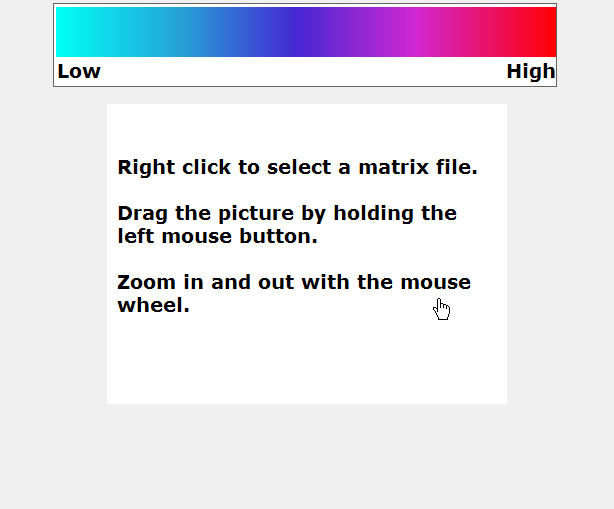

# MatrixVisualization

This application visualizes matrices (or 2D-Arrays) and allows for traversing of the matrix data. 
For big matrices it can be very difficult to see relevant structures by solely looking at the entries of the matrix.

